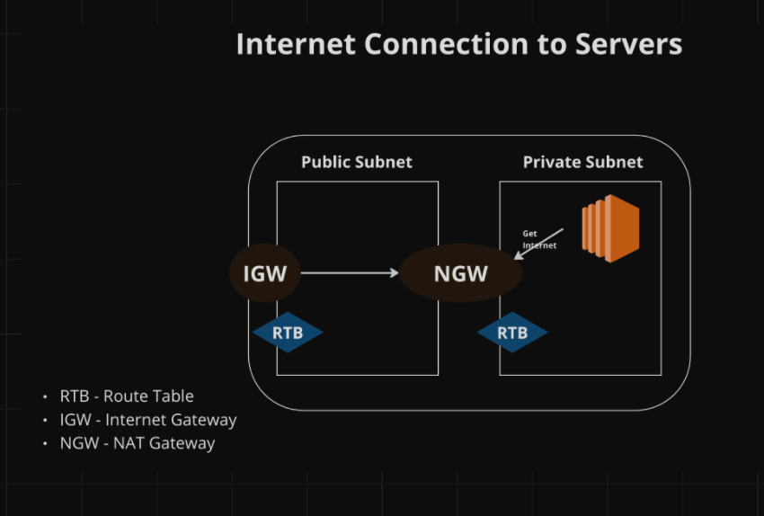
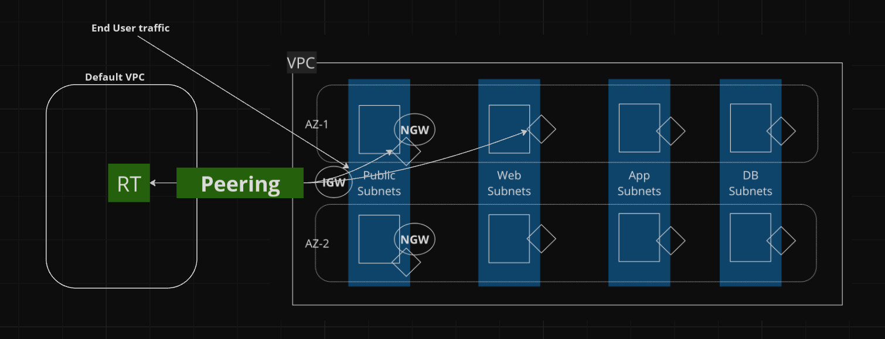
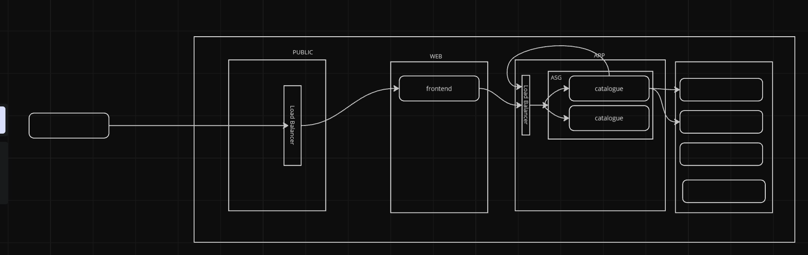

# roboshop-terraform

Server connection


Subnet layout

VPC peering should be established between default VPC and the VPC with private subnets. Route tables of default vpc and all subnets in private VPC need to be updated to establish connectivity. 

Application layout


## Terraform Documentation:

#### AWS related:

Terraform Documentation to create VPC - https://registry.terraform.io/providers/hashicorp/aws/latest/docs/resources/vpc

Terraform Documentation to create Subnets - https://registry.terraform.io/providers/hashicorp/aws/latest/docs/resources/subnet

Terraform Documentation to create Route tables - https://registry.terraform.io/providers/hashicorp/aws/latest/docs/resources/route_table

Terraform Documentation to create route table association - https://registry.terraform.io/providers/hashicorp/aws/latest/docs/resources/route_table_association

Terraform documentation to create VPC peering connection - https://registry.terraform.io/providers/hashicorp/aws/latest/docs/resources/vpc_peering_connection

Terraform documentation to create a route - https://registry.terraform.io/providers/hashicorp/aws/latest/docs/resources/route

Terraform documentation to create a launch template for EC2 auto-scaling group - https://registry.tf-registry-prod-use1.terraform.io/providers/hashicorp/aws/latest/docs/resources/launch_template

Terraform documentation to create auto-scaling groups - https://registry.terraform.io/providers/hashicorp/aws/latest/docs/resources/autoscaling_group

#### Github Actions:

Using self-hosted runners in a workflow - https://docs.github.com/en/actions/hosting-your-own-runners/managing-self-hosted-runners/using-self-hosted-runners-in-a-workflow

Using custom labels to route jobs - https://docs.github.com/en/actions/hosting-your-own-runners/managing-self-hosted-runners/using-self-hosted-runners-in-a-workflow#using-custom-labels-to-route-jobs

Using labels and groups to route jobs - https://docs.github.com/en/actions/hosting-your-own-runners/managing-self-hosted-runners/using-self-hosted-runners-in-a-workflow#using-labels-and-groups-to-route-jobs

#### Split function

Terraform documentation for split function - https://developer.hashicorp.com/terraform/language/functions/split

In this project, we are using split function to update tags with the corresponding aws az information. 
Format:
````
split(separator, string)
````
split("-", "us-east-1a") - provides "us" "east" "1a"
split("-", "us-east-1a")[2] - provides "1a"
var.availability_zones[count.index] - us-east-1a, us-east-1b
{split("-", var.availability_zones[count.index])[2]} - 1a, 1b

#### Splat Expressions

A splat expression provides a more concise way to express a common operation that could otherwise be performed with a for expression.

Hashicorp documentation - https://developer.hashicorp.com/terraform/language/expressions/splat

Medium article with examples - https://medium.com/@diliprao/understanding-terraform-splat-expressions-a-guide-with-easy-to-follow-examples-86695e71cd90

#### Tomap function 

Terraform documentation for tomap function - https://developer.hashicorp.com/terraform/language/functions/tomap. 

Tomap function is used to convert arguments to map value.


