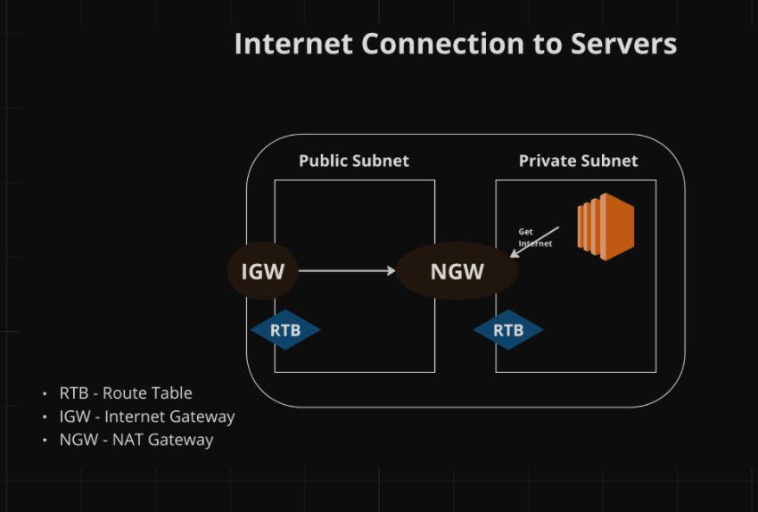
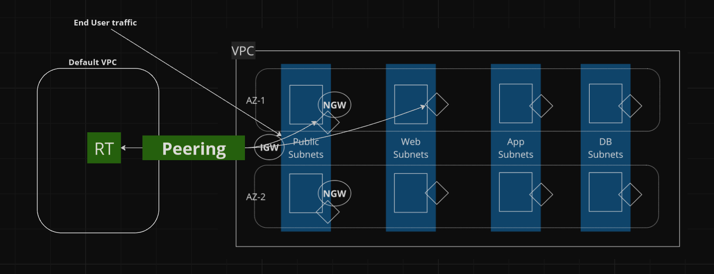
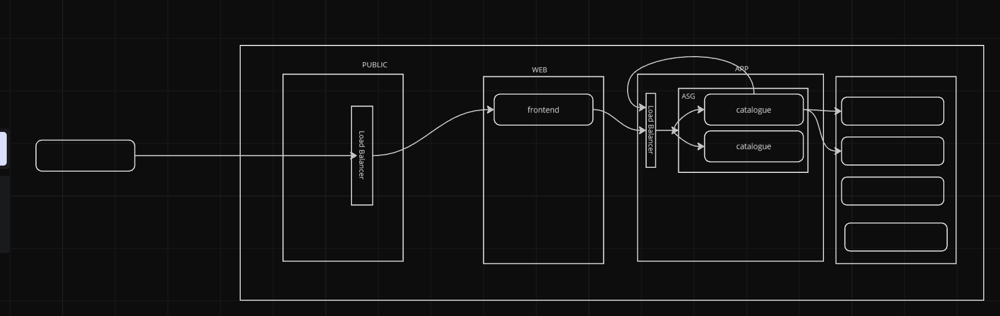

# roboshop-terraform

Server connection

Subnet layout

VPC peering should be established between default VPC and the VPC with private subnets. Route tables of default vpc and all subnets in private VPC need to be updated to establish connectivity. 

Application layout

All variable values for environments are defined in env-{env}/main.tfvars.
Bucket information to store TF State file for an env is defined in env-{env}/state.tfvars.
main.tf files in modules contain relevant resource definitions for modules.
Use run.sh or Makefile to execute manually or via pipeline.

